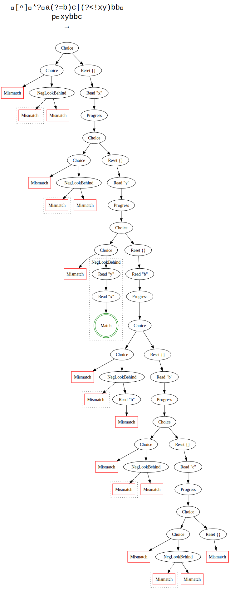

## Collected notes

### LazyPrefix module

To simplify and unify reasoning about lazy prefixed regex trees, I created the `LazyPrefix` module. It defines a helper that describes these trees easing induction on the input.

```rocq
Inductive unanchored_tree (r: regex): input -> tree -> Prop :=
| unanchored_done:
	forall inp t pref
		(INP: inp = Input [] pref)
		(TREE: is_tree rer [Areg r] inp GroupMap.empty forward t),
		unanchored_tree r inp (Choice t (GroupAction (Reset []) Mismatch))
| unanchored_iter:
	forall inp c next pref t t'
		(INP: inp = Input (c::next) pref)
		(TREE: is_tree rer [Areg r] inp GroupMap.empty forward t)
		(ITER: unanchored_tree r (Input next (c::pref)) t'),
		unanchored_tree r inp (Choice t (GroupAction (Reset []) (Read c (Progress t')))).
```

I proved the trees defined by it equivalent to the lazy prefix ones.

```rocq
Theorem unanchored_tree_lazy_prefix:
    forall r inp t,
      is_tree rer [Areg (lazy_prefix r)] inp GroupMap.empty forward t <-> unanchored_tree r inp t.
```

Induction on `unanchored_tree` gives easier proofs reasoning on the trees of a regex `r` at every input position. Thanks to it I could easily prove the following which I use in the proof of correctness of a lookaround oracle:

```rocq
Lemma lazy_prefix_exists_position:
	forall r inp tree leaf,
		is_tree rer [Areg (lazy_prefix r)] inp GroupMap.empty forward tree ->
		(
			(exists inp' tree',
				(inp' = inp \/ strict_suffix inp' inp forward)
				/\ is_tree rer [Areg r] inp' GroupMap.empty forward tree'
				/\ In leaf (tree_leaves tree' GroupMap.empty inp' forward)
			) <->
			In leaf (tree_leaves tree GroupMap.empty inp forward)
		).
```

It says that a leaf in the lazy prefixed regex tree has to be in one of the trees of the regex alone and vice versa.

I also simplified some existing proofs to use the `unanchored_tree` helper.

### Input rewinding

To compute the lookaround oracles, we must run a regex engine on the input rewound to the beginning/end. So, if we wish to have an oracle for the input zipper "abc|de" (where "|" denotes our current position in the input), we must run the regex engine on the input "|abcde". This is because lookarounds can go beyond the starting input position and thus we must also know if the lookaround matches at those positions.

For oracle correctness we need 2 lemmas about input rewinding.

Rewinding is a prefix,

```rocq
Lemma input_rewind_suffix:
	forall inp dir inp',
		input_rewind inp dir = inp' ->
		inp' = inp \/ strict_suffix inp' inp dir.
```

and two related inputs have the same rewind.

```rocq
Lemma input_rewind_suffix_eq:
	forall inp inp' dir dir',
		strict_suffix inp' inp dir ->
		input_rewind inp dir' = input_rewind inp' dir'.
```

### Tree visualization

I wrote a small Rocq script to generate GraphViz dot files to visualize backtracking trees. Given a regex, input, and direction, it will write to a file the dot representation of the backtracking tree. Then, a small shell script runs the dot compiler to produce an svg of the tree. I use it to get a better intuition for tree directions.

Example tree: 

### Leaves oracle

Now that we can collect all leaves modulo group map of a backtracking tree in linear time, we can define the lookaround oracle. Given a list of leaves, it can answer whether at some input position the lookaround matches or not. It is defined as follows:

```rocq
Definition leaves_nfa_oracle (lk: lookaround) (leaves: list leaf) : nfa_oracle :=
	fun inp =>
		let input := match lk_dir lk with
									| forward => input_reverse inp
									| backward => inp
									end in
		if in_dec input_eq_dec input (List.map fst leaves) then
			positivity lk
		else
			negb (positivity lk).
```

Depending on whether it is a lookahead or lookbehind we modify the input. Depending on whether it is a positive or negative lookaround, we expect to see and respectively not see the input in the leaves. How these leaves are collects matters, namely we define which leaves we care about in the following way:

```rocq
Definition nfa_oracle_leaves (dir: Direction) (r: regex) (inp: input) (leaves: list leaf) : Prop :=
	match dir with
	| forward => exists t,
			let input := input_reverse (input_rewind inp forward) in
			bool_tree rer [Areg (lazy_prefix (regex_reverse r))] input CanExit forward t /\
			list_ext (List.map fst leaves) (List.map fst (tree_leaves t GroupMap.empty input forward))
	| backward => exists t,
			let input := input_rewind inp backward in
			bool_tree rer [Areg (lazy_prefix r)] input CanExit forward t /\
			list_ext (List.map fst leaves) (List.map fst (tree_leaves t GroupMap.empty input forward))
	end.
```

We care about the leaves of an unanchored (lazy-prefixed) regex tree on the rewound input (either to the beginning or to the end). Additionally, we must reverse the regex for lookaheads. `list_ext` is the list extensionality of lists.

We can easily satisfy this kind of leaves collection. We simply run the PikeVM whom we already taught how to collect all leaves with the inputs/regexes as defined above.

For this kind of oracle, I have proven that it is indeed a correct oracle.

```rocq
Theorem leaves_nfa_oracle_correct:
	forall lk r inp leaves,
		pike_regex r ->
		nfa_oracle_leaves (lk_dir lk) r inp leaves ->
		nfa_oracle_correct (leaves_nfa_oracle lk leaves) inp lk r.
```

Therefore this oracle can be used to match regexes with captureless lookarounds! The proof relies on two admitted theorems which I am working on now.

### Tree direction/regex reversal

The two admitted theorems are:

- relation of forward and backward directed trees

  ```rocq
  Lemma tree_leaf_dir_reverse:
  		forall r dir inp1 inp2 gm2 t1 t2,
  			has_backreferences_actions acts = false ->
  			is_tree rer [Areg r] inp1 GroupMap.empty dir t1 ->
  			is_tree rer [Areg r] inp2 GroupMap.empty (direction_reverse dir) t2 ->
  			In (inp2, gm2) (tree_leaves t1 GroupMap.empty inp1 dir) ->
  			exists gm1, In (inp1, gm1) (tree_leaves t2 GroupMap.empty inp2 (direction_reverse dir)).
  ```

- property of reversed regex trees

  ```rocq
  Theorem tree_leaf_regex_reverse :
    forall r inp1 inp2 gm2 t1 t2 dir,
      has_backreferences r = false ->
      is_tree rer [Areg r] inp1 GroupMap.empty dir t1 ->
      is_tree rer [Areg (regex_reverse r)] (input_reverse inp2) GroupMap.empty dir t2 ->
      In (inp2, gm2) (tree_leaves t1 GroupMap.empty inp1 dir) ->
      exists gm1, In (input_reverse inp1, gm1) (tree_leaves t2 GroupMap.empty (input_reverse inp2) dir).
  ```

Both essentially say that if build a tree at position 1 and find some leaf at position 2, then if we instead construct a tree from position 2 in the other direction, we can arrive back to position 1.

Both proofs should follow a very similar reasoning. So I am focusing on the first theorem and then hope to copy paste the proof or to instead prove something relating regex reversal and backward trees to directly use the first theorem. Currently I am stuck trying to correctly express the generalization over a list of actions of the first theorem. The actions of the second tree should not be simply reversed, as this gives the incorrect order for the `Sequence` regex.

### Package maintenance

- StrictOrderSolver was released in opam-released: <https://github.com/rocq-prover/opam/pull/3729>
- Warblre supports Rocq 9.2: <https://github.com/LindenRegex/Warblre/pull/12>
- Prepare Warblre for opam-released: <https://github.com/LindenRegex/Warblre/pull/17>
- Simplify Linden setup (no more manual pinning!): <https://github.com/LindenRegex/Linden/pull/29>

## To discuss

## Action items

- Prove tree direction reversal
- Prove "all positions found" preservation
- Add CI for releasing Warblre/Linden to Rocq's opam
