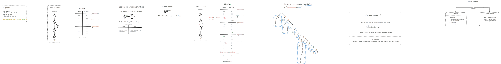

# Agenda

- Introduce myself
- I want you to leave with an understanding of what the PikeVM is how prefix acceleration works
- Give an intuition of how the proof was approached
- Talk about my future work

# PikeVM

## NFA

- A PikeVM executes an NFA against some input string
- But only at a particular string position!
  - **we want to find anywhere in the string**
- Let's look at how the PikeVM works and try to fix it

## Algorithm

- PikeVM is a linear NFA simulation algorithm
- Explore states in parallel and synchronize on the input
- **Active**: states currently being explored
- **Blocked**: states waiting for the advancement of the input

## Trace

- Order of states gives priority
- But there is a match later in the string! Let's try to find matches anywhere in the input

# Looking for a match anywhere

We cannot just run the engine at every input position: this will ruin our complexity

1. Lazy dot star, if we fail to find matches we will advance the input by one and try `r` again

   - Lazy `?` means we find the left-most match. Without it it would be the right-most match

2. Simulate it ourselves

   - Better performance
   - Allows for optimizations

# Regex prefix

- We know every potential match has to start with _"ab"_

# Traced PikeVM+

- Optim 1: no prefix
- Not filtering: maybe it leads to a match
- Optim 2: skipping many input positions

# In practice

- Implemented in the rust-regex crate (Optim 2 already present, optim 1 implemented by me)
- In rebar which is supposed to be a real world benchmarking suit
  1. optim 2 can lead to 600x times speedups
  2. optim 1 can lead to 20x times speedups
- Arguably the most important regex matching optimization

# Proof

Hopefully by now you have the intuition that this algorithm is correct. But how to approach the proof?

## Backtracking trees

- Proven to follow exactly the ECMAScript 2023 semantics
- Materialization of matching a regex against a specific input (execution trace)
  - This is opposed to the NFA, which is only a program
- As we said, we want to essentially return the same result as for `/.*?r/`
- The result is the leftmost accepting leaf

## PikeTree

- Operates on backtracking trees -> firstLeaf equivalence
- Explores like the PikeVM -> PikeVM equivalence
- The subtrees are $\alpha$ at different positions
- When we added $\alpha$ in the PikeVM, here we add a subtree. But we optimize by not adding the subtree if it contains no results

# Meta engine

- Each engine has it's own strengths and weaknesses
  - Some support only a subset of regex features, some have high memory requirements
  - OnePass: only NFAs that have one transition per character+state
  - Lazy DFA: no groups support
  - PikeVM: slow, supports everything
  - Memoized backtracker: memory intensive
- Everything is composed to find matches the fastest way
  - Sometimes it is faster to use the Lazy DFA to find the bounds of the match, and then run an anchored PikeVM

To guide optimizations, I will analyze the corpus of regexes used in the wild
